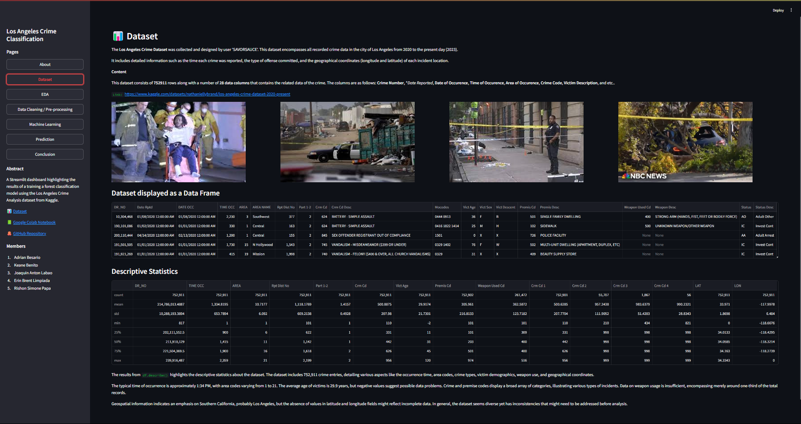

# Streamlit-Crime-Classification-Dashboard

---
A Streamlit web application that performs **Exploratory Data Analysis (EDA)**, **Data Preprocessing**, and **Supervised Machine Learning** to classify Los Angeles Crime Type from the Los Angeles Crime Dataset (Intimate Partner Assault, Stolen Vehicle, Plain Theft, Burglary, etc..) using **Random Forest Classifier**.
### 🔗 Links:
- https://colab.research.google.com/drive/1b1sZBo6abbv3cw3z_CA6pVPB7Tn-aV0c?usp=sharing

### 📊 Dataset:
- https://www.kaggle.com/datasets/nathaniellybrand/los-angeles-crime-dataset-2020-present

### Members:
-
-
- Papa, Rishon Simone V.

[Palagay nalang ng mga names sa members para ma-add kayo sa commit history - P.]

